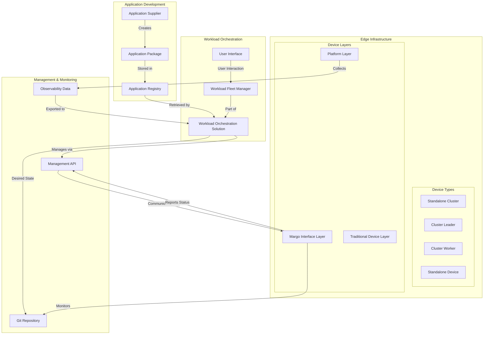

# Margo Implementation Guidelines vx.y

## Introduction

This document provides comprehensive guidance, best practices, and contextual information for implementing Margo-compliant solutions. These guidelines complement the Margo Technical Specification by offering implementation advice, design rationale, and recommendations that support the specification requirements while allowing for implementation flexibility.

---

## Mission and Vision Context

### Margo's Mission

Margo's mission emphasizes unlocking innovation barriers in industrial automation through edge interoperability. This is achieved through creation of a reference implementation, open standard, and compliance testing toolkit to facilitate the interoperable orchestration of edge applications and devices.

The Margo initiative aims to accelerate digital transformation by simplifying the deployment, scalability, and operation of industrial solutions, thereby enabling organizations to innovate and grow more efficiently.

### Addressing Industrial Edge Pain Points

Recent trends in industrial manufacturing have created lifecycle management challenges due to the massive increase of compute devices and applications from multiple suppliers deployed in plants. Key challenges include:

- **Device Proliferation**: Manufacturing plants now deploy hundreds or thousands of edge computing devices from various vendors
- **Application Complexity**: Each device may run multiple containerized applications with different lifecycle requirements
- **Multi-Vendor Environment**: Lack of standardization creates integration challenges across vendor ecosystems
- **Operational Overhead**: Manual management of diverse devices and applications becomes unsustainable at scale

Margo addresses these challenges by providing a standardized approach to device management, application packaging, and workload orchestration that works across vendor boundaries.

### Open Approach Philosophy

Margo addresses innovation barriers through widespread collaboration and interaction with peer communities. The initiative embraces open standards and community-driven development to ensure broad adoption and interoperability. This approach includes:

- **Community-Driven Development**: Specifications evolve through input from device manufacturers, software vendors, and end users
- **Open Source Reference Implementation**: Provides concrete examples of how to implement the specification
- **Vendor-Neutral Standards**: Ensures no single vendor controls the specification's direction
- **Ecosystem Integration**: Designed to work with existing industrial automation systems and standards

### Linux Foundation Hosting

Margo is hosted by the Linux Foundation, ensuring:
- **Neutral Governance**: Independent oversight and community governance
- **Legal Framework**: Proper intellectual property and contribution policies
- **Community Infrastructure**: Meeting coordination, documentation hosting, and collaboration tools
- **Standards Development**: Alignment with industry best practices for open standard development

---

## Architecture and Design Principles

### Margo Ecosystem Overview

The Margo ecosystem provides a complete framework for industrial edge interoperability as shown in the application deployment workflow:

```
---
config:
  layout: elk
---
sequenceDiagram
    actor EndUser as End User
    participant frontend as Workload Fleet Manager Frontend
    participant fleetmgr as Workload Fleet Manager
    participant registry as Application Registry
    autonumber
    EndUser->>frontend: Visits Application Catalog
    frontend->>fleetmgr: Get list of available workloads (=Apps)
    alt
    fleetmgr ->> registry: Get 'application description' from each known application registry.
    else
    fleetmgr ->> fleetmgr: Get 'application description' for all cached applications.
    end
    fleetmgr->>frontend: Return list of 'application description's
    frontend ->> frontend: Read all 'application description's -> 'metadata' element
    frontend ->> EndUser: Show UI with list of applications
    EndUser->>frontend: Select workload (=App) to install
    frontend ->> frontend: Read 'application description' -> 'configuration' element
    frontend -->> EndUser: Show UI to fill App configuration
    EndUser ->> frontend: Answer configurable questions to be applied to workload(s)
    frontend ->> fleetmgr: Create 'ApplicationDeployment' definition
```

The ecosystem also encompasses the broader infrastructure relationships:



### Interoperability Goals

The three main goals of Margo's application description model enable workload fleet managers to:

**Display Workload Information**: Present comprehensive application catalogs with metadata, descriptions, and deployment requirements that help users make informed decisions about which applications to deploy.

**Determine Device Compatibility**: Automatically match workloads with compatible edge devices based on processor architecture, available resources, required capabilities (GPU presence, special hardware), and supported container runtimes.

**Capture Configuration Information**: Provide user-friendly interfaces for specifying application parameters during deployment and updates, with built-in validation to prevent configuration errors.

### Device Architecture Philosophy

Margo devices consist of three conceptual layers that provide clear separation of concerns:

*Note: Device layers diagram referenced in specification at: https://specification.margo.org/margo-overview/devices-overview/*

```
┌─────────────────────────────────────────────────────────────┐
│                    Margo Interface Layer                    │
│  ┌─────────────────────────────────────────────────────┐   │
│  │         Margo Management Interface Client           │   │
│  │    (Device Registration, Capability Reporting,     │   │
│  │     State Monitoring, Deployment Status)           │   │
│  └─────────────────────────────────────────────────────┘   │
└─────────────────────────────────────────────────────────────┘
┌─────────────────────────────────────────────────────────────┐
│                     Platform Layer                         │
│  ┌─────────────────────┐  ┌─────────────────────────────┐  │
│  │   Container Runtime │  │  Orchestration Platform    │  │
│  │   (Docker, Podman,  │  │  (Kubernetes, Docker       │  │
│  │   containerd)       │  │   Compose, etc.)           │  │
│  └─────────────────────┘  └─────────────────────────────┘  │
└─────────────────────────────────────────────────────────────┘
┌─────────────────────────────────────────────────────────────┐
│                 Traditional Device Layer                    │
│  ┌─────────────────────┐  ┌─────────────────────────────┐  │
│  │  Hardware Platform  │  │    Base Operating System   │  │
│  │  (CPU, Memory,      │  │    (Linux, Windows,        │  │
│  │   Storage, Network, │  │     embedded OS)           │  │
│  │   Industrial I/O)   │  │                            │  │
│  └─────────────────────┘  └─────────────────────────────┘  │
└─────────────────────────────────────────────────────────────┘
```

**Margo Interface Layer**: Hosts the Margo management interface client that communicates with workload orchestration solutions. This layer handles device registration, capability reporting, desired state monitoring, and deployment status reporting.

**Platform Layer**: Contains the container runtime and orchestration platform (Kubernetes, Docker, Podman). This layer provides the execution environment for containerized workloads and abstracts underlying hardware differences.

**Traditional Device Layer**: Encompasses the hardware platform and base operating system. This layer provides compute, storage, networking, and any specialized industrial hardware interfaces.

### Device Role Architecture

Margo supports multiple device roles to accommodate different deployment scenarios:

**Supported Device Roles**:
- **Standalone Cluster**: Devices that operate as independent cluster functionality
- **Cluster Leader**: Devices that provide leadership role in a multi-device cluster configuration
- **Cluster Worker**: Devices that operate as worker nodes in a multi-device cluster
- **Standalone Device**: Devices that operate independently with single-device functionality

**Role Evolution**: Additional device roles will be introduced as the specification matures to support evolving industrial edge requirements.

**Implementation Flexibility**: Device vendors have freedom of implementation regarding specific components (e.g., OCI container runtime), as long as the component provides the agreed upon functionality that Application Vendors expect.

### Deployment Profile Strategy

**Multi-Profile Approach**: Applications should define deployment profiles for both Helm charts AND Compose components to maximize compatibility across different edge device types, even when one deployment method cannot be implemented.

**Benefits of Multi-Profile Design**:
- **Simplified Maintenance**: Single source of truth for application metadata and configuration
- **Consistent User Experience**: Users see one application that works across their device fleet
- **Efficient Distribution**: Reduced storage and bandwidth requirements compared to separate packages
- **Version Management**: Simplified version control and update processes

**Implementation Flexibility**: If either deployment profile cannot be implemented, it MAY be omitted, but Margo RECOMMENDS defining both profiles to strengthen interoperability and applicability.

---

## Implementation Best Practices

### Security Implementation Guidelines

#### Digital Signing and Package Integrity
- **Highly Recommended**: Digitally sign all application packages using PGP encryption to ensure authenticity and integrity
- **Key Management**: Implement proper key distribution and rotation mechanisms for package signing
- **Verification Process**: Device management clients should verify package signatures before installation
- **Registry Security**: Implement secure container registry authentication for private registries using industry-standard protocols

#### Communication Security
- **API Communications**: Use HTTPS/TLS for all Management API communications between devices and workload orchestration solutions
- **Authentication**: Implement OAuth2 client credentials flow as specified in the Management API for device authentication
- **Authorization**: Use proper role-based access control to limit device and user permissions
- **Certificate Management**: Consider certificate-based device authentication for enhanced security in industrial environments

#### Payload Signing Implementation
- **Message Integrity**: Implement the specified SHA-256 hash and digital signature process for critical communications
- **Certificate Management**: Establish proper certificate authority and distribution mechanisms
- **Verification Workflows**: Implement automated verification of signed payloads in production systems
- **Error Handling**: Design robust error handling for signature verification failures

#### Network Security Considerations
- **Firewall Configuration**: Document required network ports and protocols for proper firewall configuration
- **Network Segmentation**: Consider industrial network segmentation requirements when designing connectivity
- **VPN Integration**: Support for industrial VPN solutions where required by operational security policies

### Device Implementation Guidance

#### Management Client Architecture
- **Containerized Deployment**: Deploy device management clients as containerized services to enable easier lifecycle management, updates, and consistency across device types (preferred but not required)
- **High Availability**: Consider implementing redundancy patterns for critical edge deployments where device downtime has significant operational impact
- **Resource Management**: Implement resource limits and monitoring for management client containers to prevent interference with workloads
- **Graceful Degradation**: Design clients to continue operating effectively during network connectivity issues or partial service failures

#### Comprehensive Capability Reporting
Device capability reports should include detailed information to enable accurate workload-to-device matching:

**Hardware Capabilities**:
- Processor architecture (x86_64, ARM64, etc.) and specific CPU features
- Available memory (total, available for workloads)
- Storage capacity and types (SSD, HDD, network storage)
- Network interfaces and connectivity options
- Specialized hardware (GPU, FPGA, industrial I/O modules, sensor interfaces)
- Device peripherals and specialized components

**Software Environment**:
- Supported container runtimes and versions
- Available orchestration platforms
- Operating system details and kernel capabilities
- Installed software dependencies and libraries

**Operational Characteristics**:
- Power management capabilities and constraints
- Environmental operating conditions (temperature, humidity ranges)
- Maintenance windows and availability requirements
- Security posture and compliance capabilities

#### Device Role Implementation Guidance

**Standalone Cluster Implementation**:
- Design for independent operation without external cluster dependencies
- Implement local resource management and workload scheduling
- Consider resource constraints and optimization for single-device deployments
- Plan for offline operation capabilities

**Cluster Leader Implementation**:
- Implement cluster coordination and management capabilities
- Design leadership election mechanisms for high availability scenarios
- Implement cluster-wide resource scheduling and management
- Provide cluster monitoring and health management functions

**Cluster Worker Implementation**:
- Design for reliable communication with cluster leaders
- Implement resource reporting and workload execution capabilities
- Handle leader failover and re-election scenarios gracefully
- Optimize for resource efficiency in multi-node environments

#### Configuration Management Best Practices
- **Persistent Configuration**: Store device configuration in persistent storage that survives reboots and updates
- **Configuration Validation**: Implement validation of configuration changes before applying them
- **Rollback Capabilities**: Provide mechanisms to revert to previous known-good configurations
- **Configuration Backup**: Regular backup of device configurations for disaster recovery

#### Extended Downtime Support
- **Graceful Handling**: Implement support for extended device communication downtime scenarios
- **Retry Logic**: Design intelligent retry mechanisms that respect configured downtime periods
- **Error Suppression**: Implement logic to ignore communication errors during known downtime periods
- **Reconnection Strategies**: Develop robust reconnection strategies for when devices come back online

### Workload Orchestration Implementation

#### Repository Management Strategies
- **Efficient Caching**: Implement intelligent caching mechanisms for application descriptions to reduce network overhead and improve response times
- **Distributed Registries**: Support multiple application registries and container registries to enable distributed deployment scenarios
- **Offline Operation**: Plan for scenarios where edge devices operate with limited or intermittent connectivity to central systems
- **Registry Synchronization**: Implement synchronization mechanisms for maintaining consistency across distributed registry instances

#### Git Repository Management
- **Repository Structure**: Design proper Git repository structure following GitOps best practices
- **Access Control**: Implement proper access control mechanisms for Git repositories containing desired state
- **Branch Strategies**: Develop appropriate branching strategies for managing device-specific configurations
- **Change Tracking**: Leverage Git's change tracking capabilities for audit trails and rollback scenarios

#### User Experience Design
- **Intuitive Interfaces**: Design workload catalog interfaces that present complex technical information in user-friendly formats
- **Deployment Visualization**: Implement clear status dashboards showing deployment progress, device health, and workload performance
- **Bulk Operations**: Support bulk deployment, update, and monitoring operations for managing large device fleets efficiently
- **Error Handling**: Provide clear error messages and recovery guidance when deployments fail
- **Workflow Implementation**: Follow the standardized application selection and deployment workflow as specified in the sequence diagram

#### Application Registry Integration
- **Manual Registry Setup**: Always provide capability for end users to manually setup connections to application registries
- **Enhanced User Experience**: Consider providing pre-configured application registries for common use cases
- **Security Best Practices**: Implement standard secure connectivity practices for registry connections
- **Registry Discovery**: Design mechanisms for discovering and validating application registries

#### Scalability Considerations
- **Fleet Size Planning**: Design for scalability to support hundreds or thousands of edge devices
- **Performance Optimization**: Implement efficient algorithms for device-to-workload matching and resource allocation
- **Database Design**: Use appropriate data storage technologies for managing device and application metadata at scale
- **API Rate Limiting**: Implement proper rate limiting and throttling to prevent system overload

---

## Application Development Guidelines

### Multi-Profile Application Design

**Strategic Approach**: Create application descriptions with multiple deployment profiles to target different edge device types (ARM vs. x86, Kubernetes vs. Docker) within a single application package rather than maintaining separate packages.

### Configuration Parameter Design Philosophy

When designing configurable parameters for applications:

**Parameter Organization**:
- **Logical Grouping**: Group related parameters into named configuration sections for better user experience
- **Clear Descriptions**: Provide detailed parameter descriptions that explain purpose, impact, and valid values
- **Sensible Defaults**: Choose default values that work in most deployment scenarios without user modification
- **Validation Rules**: Implement comprehensive validation to prevent configuration errors

**User Experience Considerations**:
- **Progressive Disclosure**: Present basic configuration options first, with advanced options available but not overwhelming
- **Contextual Help**: Provide tooltips, examples, and links to documentation for complex parameters
- **Dependency Handling**: Clearly indicate when parameters depend on or conflict with other settings
- **Preview Capabilities**: Allow users to preview the impact of configuration changes before applying them

**Schema Design**:
- **Data Type Support**: Utilize all supported schema types (string, boolean, integer, double, select options)
- **Validation Rules**: Implement appropriate validation rules for each parameter type
- **Error Messages**: Provide clear, actionable error messages for validation failures
- **Target Specification**: Clearly specify where parameters apply in the deployment using pointer notation

### Application Package Development

**Package Structure Guidelines**:

```
Application Package Structure:
┌─────────────────────────────────────────────┐
│                   /                         │
│  ┌─────────────────────────────────────┐   │
│  │         margo.yaml                  │   │ ← Application Description
│  │  (ApplicationDescription YAML)     │   │   (REQUIRED)
│  └─────────────────────────────────────┘   │
│  ┌─────────────────────────────────────┐   │
│  │           resources/                │   │ ← Application Resources
│  │  ├── icon.png                      │   │   (OPTIONAL)
│  │  ├── description.md                │   │
│  │  ├── release-notes.md              │   │
│  │  ├── license.pdf                   │   │
│  │  └── additional-docs/              │   │
│  └─────────────────────────────────────┘   │
└─────────────────────────────────────────────┘

Deployment Artifacts (stored separately):
┌─────────────────────────────────────────────┐
│          Container Registry                 │
│  ┌─────────────────────────────────────┐   │
│  │        OCI Containers               │   │
│  │   (Referenced by manifests)        │   │
│  └─────────────────────────────────────┘   │
└─────────────────────────────────────────────┘
┌─────────────────────────────────────────────┐
│           Helm Registry                     │
│  ┌─────────────────────────────────────┐   │
│  │         Helm Charts                 │   │
│  │  (For Kubernetes deployments)      │   │
│  └─────────────────────────────────────┘   │
└─────────────────────────────────────────────┘
```

- **Resource Organization**: Organize application resources (icons, documentation, licenses) in the resources folder
- **Documentation Quality**: Provide comprehensive description files, release notes, and licensing information
- **Metadata Completeness**: Include complete author and organization information for proper attribution
- **Version Management**: Implement clear versioning strategies for application packages

**Deployment Profile Implementation**:
- **Helm Chart Development**: Follow Helm v3 best practices for chart development and packaging
- **Compose Specification**: Implement Docker Compose specifications that are portable across environments
- **Component Organization**: Structure deployment components for maintainability and clarity
- **Property Management**: Use appropriate properties for timeout, wait conditions, and revision control

### Resource Requirements Planning

**Current Capabilities**: The specification currently supports basic resource specification through Helm and Compose deployment profiles.

**Future Evolution**: The specification will evolve to include more sophisticated compatibility information:

**Compute Resources**:
- CPU requirements (cores, architecture, specific instruction sets)
- Memory requirements (minimum, recommended, maximum)
- Storage requirements (capacity, performance, persistence needs)
- Network bandwidth and latency requirements

**Dependencies and Services**:
- Required infrastructure services (databases, message queues, reverse proxies)
- Application dependencies and version requirements
- External service integrations and API requirements
- Authentication and authorization requirements

**Planning Recommendations**:
- Design applications with resource efficiency in mind for edge deployment scenarios
- Document resource requirements clearly even when not formally specified in deployment profiles
- Consider implementing resource monitoring and alerting within applications
- Plan for resource constraint scenarios common in industrial edge environments

---

## Observability Implementation Guidelines

### OpenTelemetry Implementation

**Signal Types**: Implement collection of all three OpenTelemetry signal types:

**Metrics Collection**:
- System metrics (CPU, memory, disk, network utilization)
- Container metrics (resource usage, restart counts, health status)
- Application metrics (custom business metrics from workloads)
- Infrastructure metrics (device health, connectivity status)

**Logging Implementation**:
- Structured logging using consistent formats
- Centralized log collection and aggregation
- Log retention policies appropriate for edge environments
- Security event logging for audit trails

**Distributed Tracing**:
- Request tracing across distributed workload components
- Performance bottleneck identification
- Error propagation tracking
- Cross-service dependency mapping

**Implementation Considerations**:
- **Resource Efficiency**: Minimize observability overhead on resource-constrained edge devices
- **Data Retention**: Implement appropriate data retention policies for edge storage constraints
- **Network Efficiency**: Use efficient data compression and transmission for limited bandwidth scenarios
- **Privacy Protection**: Ensure observability data doesn't expose sensitive industrial information

**Scope Limitations**:
- **Device-Focused**: Limit observability to device, platform, and workload monitoring
- **Industrial Boundary**: Do not extend observability to production processes, machinery, controllers, or sensors
- **Purpose Alignment**: Focus on debugging, diagnostics, and resource management rather than process monitoring

---

## Authentication and Authorization Guidelines

### Device Authentication Best Practices

**Token Management**:
- Secure storage of client credentials on devices
- Automatic token refresh mechanisms
- Token revocation support for compromised devices
- Certificate-based authentication for enhanced security scenarios

**Authorization Patterns**:
- Role-based access control (RBAC) for different device types and user roles
- Fine-grained permissions for specific operations (deploy, monitor, configure)
- Principle of least privilege for all system components
- Regular credential rotation policies

**OAuth2 Implementation**:
- **Client Credentials Flow**: Implement proper OAuth2 client credentials flow for device authentication
- **Token Lifetime Management**: Design appropriate token expiration and refresh mechanisms
- **Error Handling**: Implement robust error handling for authentication failures
- **Security Monitoring**: Monitor authentication attempts and implement alerting for suspicious activity

### Security Monitoring and Auditing

**Audit Trail Requirements**:
- Log all authentication attempts and results
- Track configuration changes and who made them
- Monitor deployment activities and status changes
- Implement security event correlation and alerting

---

## Testing and Validation Guidelines

### Development Testing Strategies

**Unit Testing**: Implement comprehensive unit tests for all management client and server components, focusing on API interactions, state management, and error handling scenarios.

**Integration Testing**: Test interactions between management clients, orchestration servers, and application registries using realistic network conditions and failure scenarios.

**End-to-End Testing**: Validate complete deployment workflows from application selection through deployment completion, including rollback scenarios and error recovery.

**Workflow Testing**: Validate the standardized application selection and deployment workflow as specified in the sequence diagram, testing all branches and error conditions.

### Compliance Testing Framework

**Future Deliverable**: Margo will provide an open compliance test suite to validate:

**Application Package Testing**:
- YAML schema validation for ApplicationDescription documents
- Deployment profile validation for Helm and Compose packages
- Configuration parameter validation and edge case testing
- Package integrity and security verification

**Device Interface Testing**:
- Management API client implementation validation
- Device role functionality validation (Standalone Cluster, Cluster Leader, Cluster Worker, Standalone Device)
- State synchronization and application testing
- Error handling and recovery procedure validation
- Performance and resource usage validation

**Workload Orchestration Testing**:
- Management API server implementation validation
- Multi-device deployment scenario testing
- Failure recovery and rollback procedure testing
- Integration testing with various device types and roles

### Interoperability Validation

**Cross-Vendor Testing**: Validate compatibility across different vendor implementations:

**Device Compatibility**:
- Test applications across different device vendors and architectures
- Validate consistent behavior across different container runtimes
- Test network connectivity scenarios and failure modes
- Validate security implementations across vendor boundaries
- Test device role interoperability in cluster configurations

**Orchestration Compatibility**:
- Test workload orchestration solutions with various device types and roles
- Validate application package compatibility across different orchestration platforms
- Test user interface consistency and functionality
- Validate performance across different scale scenarios

**Real-World Scenario Testing**:
- Industrial environment simulation testing
- Network connectivity variation testing
- Long-running deployment stability testing
- Disaster recovery and backup procedure testing

---

## Migration and Adoption Strategies

### Incremental Adoption Approach

**Phased Implementation**: Organizations can adopt Margo incrementally to reduce risk and complexity:

**Phase 1 - Pilot Deployment**:
- Start with a small subset of edge devices and applications
- Focus on understanding operational impacts and benefits
- Develop internal expertise and procedures
- Validate integration with existing systems

**Phase 2 - Expanded Deployment**:
- Scale to larger device fleets and more complex applications
- Implement production monitoring and alerting
- Optimize performance based on pilot learnings
- Establish operational procedures and training

**Phase 3 - Full Production**:
- Deploy across entire edge infrastructure
- Implement advanced features like multi-site coordination
- Develop custom applications using Margo patterns
- Contribute back to the community based on experience

### Legacy System Integration

**Coexistence Strategies**: Margo can be implemented alongside existing edge management systems:

**Gradual Migration**:
- Migrate devices incrementally to Margo management
- Maintain parallel systems during transition periods
- Use application packaging to standardize deployment formats
- Implement monitoring to compare system performance

**API Integration**:
- Develop adapters to integrate Margo with existing systems
- Use management APIs to bridge between systems
- Implement data synchronization for device and application state
- Provide unified dashboards across management systems

---

## Community Engagement Framework

### Specification Evolution Process

The specification evolves through structured community input and real-world implementation experience:

**Contribution Guidelines**:
- Engage early with proposed changes through GitHub issues and community discussions
- Validate design proposals against actual industrial use cases and requirements
- Consider backward compatibility implications for existing implementations
- Participate in reference implementation development and testing
- Contribute to compliance test suite development and validation

**Community Resources**:
- Regular community meetings and technical working group sessions
- Documentation and tutorial development
- Best practices sharing and case study development
- Mentorship programs for new contributors and implementers

**Standards Development**:
- Alignment with relevant industrial automation standards and protocols
- Coordination with related open source and standards organizations
- International standardization activities and industry adoption initiatives
- Intellectual property policies and contributor licensing agreements

### Open Web Foundation Licensing

**Contribution Requirements**:
- Contributors to the specification are required to sign the appropriate Contributor License Agreement (CLA)
- Contributions are subject to the Open Web Foundation Contributor License Agreement Contribution Copyright Grant
- Legal framework ensures open access and patent protection for implementers

---

## Future Extensibility Design

While Margo initially targets Helm and Compose deployments, the specification is designed to support additional deployment types in the future. The application description model abstracts implementation details to ease support for current and future deployment types without requiring special logic for each type.

**Extension Points Include**:
- Additional orchestration platforms (K3s, OpenShift, custom platforms)
- Enhanced resource requirement specifications
- Advanced networking and security configurations
- Integration with industrial automation protocols
- New device roles for specialized industrial scenarios

**Architectural Considerations**:
- Maintain backward compatibility with existing device roles
- Design extensible interfaces for new capabilities
- Plan for evolution of the three-layer device architecture
- Consider emerging edge computing paradigms and requirements

---

## Conclusion

These comprehensive guidelines provide the context, rationale, and practical advice needed to successfully implement Margo-compliant solutions while maintaining compliance with the technical specification requirements. The guidelines encompass the full scope of the Margo ecosystem, from device roles and architecture to application development and community engagement.

As the ecosystem continues to evolve through community input and real-world deployment experience, these guidelines will be updated to reflect emerging best practices and lessons learned. The success of Margo depends on active community participation and feedback from implementers across the industrial automation ecosystem.

Organizations are encouraged to engage with the community, share their experiences, and contribute to the continued evolution of both the specification and these implementation guidelines. The collaborative approach ensures that Margo remains relevant and valuable for the industrial edge computing community.

For the latest updates, community discussions, and contribution opportunities, visit [margo.org](https://margo.org) and engage with the Margo community through the Linux Foundation channels.
