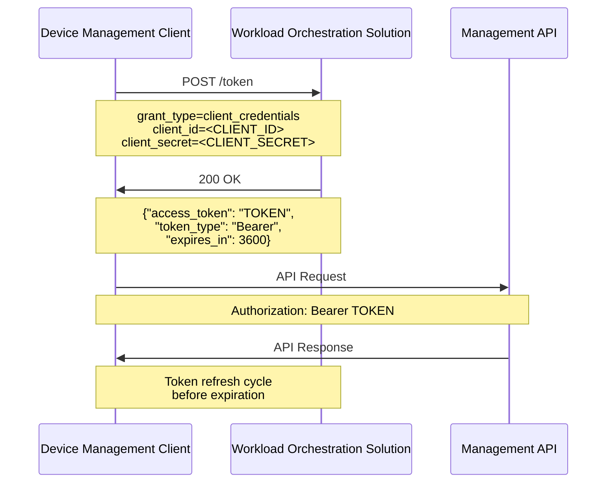
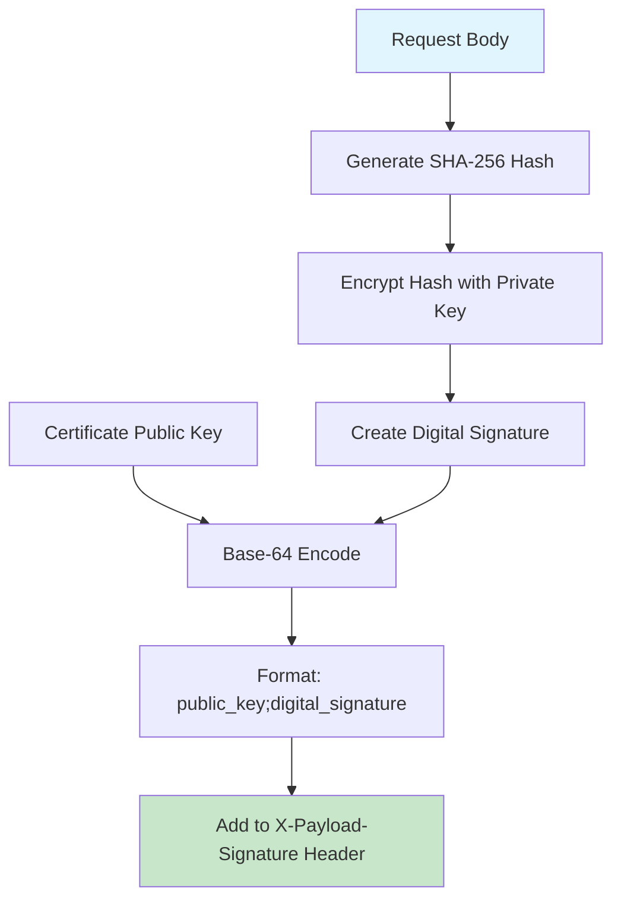
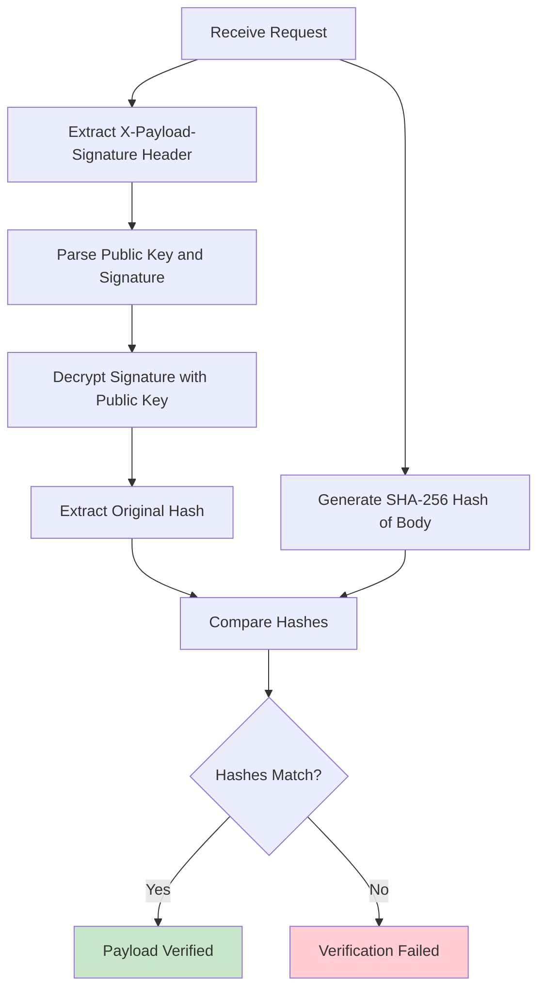
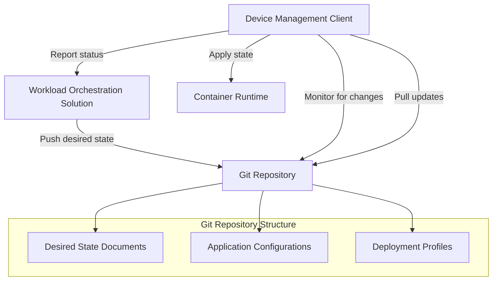
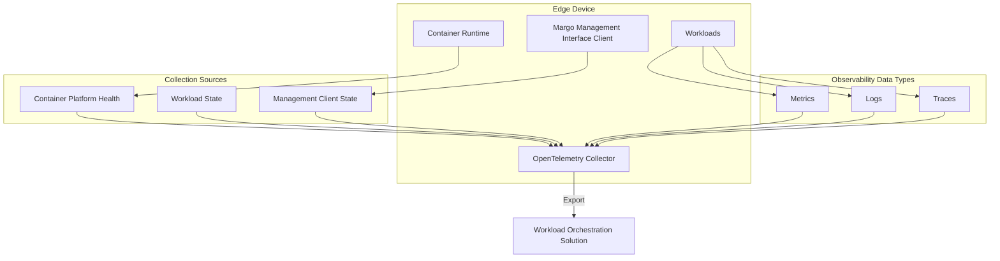

# Margo Technical Specification vx.y

## Scope and Purpose

This technical specification defines the mandatory requirements, interfaces, and protocols for achieving interoperability in industrial edge automation ecosystems. This specification is normative and defines testable requirements for compliance.

**Normative Language**: This specification uses the key words "MUST", "MUST NOT", "REQUIRED", "SHALL", "SHALL NOT", "SHOULD", "SHOULD NOT", "RECOMMENDED", "MAY", and "OPTIONAL" as defined in RFC 2119.

## Management API Specification

### Authentication and Authorization

#### OAuth2 Implementation Requirements
Authentication **MUST** use OAuth2 client credentials flow as depicted in the following sequence:



- For requests requiring authentication, a bearer token **MUST** be present in the message's Authorization header

#### Token Acquisition
Access tokens **MUST** be obtained using the following format:
```bash
curl -X POST \
  -H "Content-Type: application/x-www-form-urlencoded" \
  -d "grant_type=client_credentials&client_id=<CLIENT_ID>&client_secret=<CLIENT_SECRET>" \
  <WOS_Token_URL>
```

#### Token Response Format
The token response **MUST** include:
```json
{
  "access_token": "ACCESS_TOKEN",
  "token_type": "Bearer", 
  "expires_in": 3600
}
```

#### Authorization Header Format
Authorization headers **MUST** use the format:
```
Authorization: Bearer <ACCESS_TOKEN>
```

### Payload Signing Requirements

#### Signing Process
The following steps **MUST** be used to sign a payload:



1. Generate a SHA-256 hash value for the request's body
2. Create a digital signature by using the message source certificate's private key to encrypt the hash value
3. Base-64 encode the certificate's public key and the digital signature in the format: `<public key>;<digital signature>`
4. Include the base-64 encoded string in the request's `X-Payload-Signature` header

#### Verification Process
The following steps **MUST** be used to verify signed payloads:



1. Retrieve the public key from the `X-Payload-Signature` header
2. Decrypt the digital signature using the public key to get the original hash value
3. Generate a SHA-256 hash value for the request's body
4. Ensure the generated hash value matches the hash value from the message

## Device Management Interface Requirements

### Management Interface Compliance Requirements

The Management Interface **MUST** provide the following functionality:
- Device onboarding with the workload orchestration solution
- Device capabilities reporting
- Identifying desired state changes
- Deployment status reporting

### Implementation Requirements

#### Server Requirements
- Workload Fleet Management vendors **MUST** implement the server side of the API specification
- The Workload Fleet Management vendors solution **MUST** maintain a storage repository to store the managed edge device's associated set of desired state files
- Desired state files **MUST** be available upon request (storage implementation is not specified)

#### Client Requirements
- Device vendors **MUST** implement a client following the API specification
- The device's management client **MUST** retrieve the device's set of desired state files from the Workload Fleet Manager
- Interface patterns **MUST** support extended device communication downtime
- The Management Interface **MUST** reference industry security protocols and port assignments for both client and server interactions

### Configuration Requirements

The Management Interface **MUST** allow an end user to configure the following:

#### Downtime Configuration
- Ensures the device's management client is not retrying communication when operating under a known downtime
- Communication errors **MUST** be ignored during this configurable period

#### Polling Configuration
- **Polling Interval Period**: Configurable time period indicating the hours in which the device's management client checks for updates to the device's desired state
- **Polling Interval Rate**: Rate for how frequently the device's management client checks for updates to the device's desired state

## Device Capabilities Reporting

### Capability Reporting Requirements

- The device owner **MUST** report their device's capabilities and characteristics via the Device API when onboarding the device with the workload orchestration solution
- Device capabilities are reported to the workload orchestration web service using Margo management API
- During the lifecycle of the Edge device, if there is a change that impacts the reported characteristics, the device's interface **SHALL** send an update to the Workload Fleet Manager

### Device Roles and Architecture Compliance

#### Supported Device Roles
Margo devices **MUST** support one of the following roles:
- **Standalone Cluster**: Independent cluster functionality
- **Cluster Leader**: Leadership role in a multi-device cluster
- **Cluster Worker**: Worker node role in a multi-device cluster  
- **Standalone Device**: Independent single-device functionality

#### Device Layer Architecture
Margo devices **MUST** implement three major layers as depicted in the following diagram:

*Source: Device layers diagram referenced in Margo specification repository at https://github.com/margo/specification/tree/pre-draft/system-design*

```
┌─────────────────────────────────────────────────────────────┐
│                    Margo Interface Layer                    │
│  ┌─────────────────────────────────────────────────────┐   │
│  │         Margo Management Interface Client           │   │
│  │    (Device Registration, Capability Reporting,     │   │
│  │     State Monitoring, Deployment Status)           │   │
│  └─────────────────────────────────────────────────────┘   │
└─────────────────────────────────────────────────────────────┘
┌─────────────────────────────────────────────────────────────┐
│                     Platform Layer                         │
│  ┌─────────────────────┐  ┌─────────────────────────────┐  │
│  │   Container Runtime │  │  Orchestration Platform    │  │
│  │   (Docker, Podman,  │  │  (Kubernetes, Docker       │  │
│  │   containerd)       │  │   Compose, etc.)           │  │
│  └─────────────────────┘  └─────────────────────────────┘  │
└─────────────────────────────────────────────────────────────┘
┌─────────────────────────────────────────────────────────────┐
│                 Traditional Device Layer                    │
│  ┌─────────────────────┐  ┌─────────────────────────────┐  │
│  │  Hardware Platform  │  │    Base Operating System   │  │
│  │  (CPU, Memory,      │  │    (Linux, Windows,        │  │
│  │   Storage, Network, │  │     embedded OS)           │  │
│  │   Industrial I/O)   │  │                            │  │
│  └─────────────────────┘  └─────────────────────────────┘  │
└─────────────────────────────────────────────────────────────┘
```

**Layer Definitions**:
- **Margo Interface Layer**: Hosts the Margo management interface client
- **Platform Layer**: Contains container runtime and orchestration platform  
- **Traditional Device Layer**: Hardware platform and base operating system

#### Implementation Compliance
- Devices **MUST** implement compliance with hosting the Margo management interface client while maintaining implementation freedom for underlying components
- Device vendors have freedom of implementation regarding specific components (e.g., OCI container runtime), as long as the component provides the agreed upon functionality
- Additional device roles will be introduced as the specification matures

## Workload Deployment Requirements

### GitOps Deployment Model

Margo uses an OpenGitOps approach for managing the edge device's desired state as illustrated in the following workflow:



**Requirements**:
- The workload orchestration solution **MUST** store the device's desired state documents within a Git repository the device's management client can access
- The device's management client **MUST** monitor the device's Git repository for updates to the desired state using the URL and access token provided by the workload orchestration solution during onboarding

### State Management Requirements

- When the device's management client notices a difference between the current (running) state and the desired state, it **MUST** pull down and attempt to apply the new desired state
- While the new desired state is being applied, the device's management client **MUST** report progress on state changes using the Device API

### Deployment Status Reporting

The deployment status **MUST** be sent to the workload orchestration web service using the Device API when there is a change in the deployment state. Required states include:

#### State Definitions
- **Pending**: Device management client has received the updated desired state but has not started applying it. When reporting this state, indicate the reason
- **Installing**: Device management client has started the process of applying the desired state  
- **Failure**: Desired state fails to be applied - error message and error code **MUST** be reported

## Application Package Requirements

### Package Structure Requirements

Application packages **MUST** contain the following elements:

#### Application Description
- A YAML document with the element `kind` defined as `ApplicationDescription`
- **SHALL** be stored in a file (e.g., named `margo.yaml`)
- There **SHALL** be only one YAML file in the package root of kind `ApplicationDescription`

#### Required File Structure
```
/ # REQUIRED top-level directory
└── application description # REQUIRED YAML document with 'kind' as 'ApplicationDescription'
└── resources # OPTIONAL folder with application resources
```

### Deployment Profile Requirements

The deployment profiles specified in the application description **SHALL** be defined as Helm Charts AND/OR Compose components:

#### Kubernetes Deployment
- To target devices which run Kubernetes, applications **MUST** be packaged as Helm charts using Helm (version 3)

#### Compose Deployment  
- To target devices which deploy applications using Compose, applications **MUST** be packaged as a tarball file containing the compose.yml file and any additional artifacts referenced by the Compose file
- When digitally signing the package, PGP encryption **MUST** be used

#### Deployment Constraint
A device running the application will only install the application using either Compose files or Helm Charts but not both.

### Application Description Schema Requirements

#### Required ApplicationDescription Structure
```yaml
apiVersion: margo.org/v1-alpha1
kind: ApplicationDescription
metadata:
  id: [REQUIRED unique identifier]
  name: [REQUIRED display name]
  description: [REQUIRED description]
  version: [REQUIRED version string]
catalog:
  application:
    icon: [OPTIONAL path to icon file]
    tagline: [OPTIONAL short description]
    descriptionFile: [OPTIONAL path to description file]
    releaseNotes: [OPTIONAL path to release notes]
    licenseFile: [OPTIONAL path to license file]
    site: [OPTIONAL website URL]
    tags: [OPTIONAL array of tag strings]
author:
  - name: [REQUIRED author name]
    email: [OPTIONAL author email]
organization:
  - name: [REQUIRED organization name]
    site: [OPTIONAL organization website]
deploymentProfiles:
  - type: [REQUIRED: "helm.v3" or "compose"]
    components: [REQUIRED array of deployment components]
parameters: [OPTIONAL configuration parameters]
configuration: [OPTIONAL configuration layout]
schema: [OPTIONAL validation rules]
```

#### Complete ApplicationDescription Examples

**Simple Hello World Example**:
```yaml
apiVersion: margo.org/v1-alpha1
kind: ApplicationDescription
metadata:
  id: com-northstartida-hello-world
  name: Hello World
  description: A basic hello world application
  version: "1.0"
catalog:
  application:
    icon: ./resources/hw-logo.png
    tagline: Northstar Industrial Application's hello world application.
    descriptionFile: ./resources/description.md
    releaseNotes: ./resources/release-notes.md
    licenseFile: ./resources/license.pdf
    site: http://www.northstar-ida.com
    tags: ["monitoring"]
author:
  - name: Roger Wilkershank
    email: rpwilkershank@northstar-ida.com
organization:
  - name: Northstar Industrial Applications
    site: http://northstar-ida.com
deploymentProfiles:
  - type: helm.v3
    components:
      - name: hello-world
        properties:
          repository: oci://northstarida.azurecr.io/charts/hello-world
          revision: 1.0.1
          wait: true
parameters:
  greeting:
    value: Hello
    targets:
      - pointer: global.config.appGreeting
        components: ["hello-world"]
  greetingAddressee:
    value: World
    targets:
      - pointer: global.config.appGreetingAddressee
        components: ["hello-world"]
configuration:
  sections:
    - name: General Settings
      settings:
        - parameter: greeting
          name: Greeting
          description: The greeting to use.
          schema: requireText
        - parameter: greetingAddressee
          name: Greeting Addressee
          description: The person, or group, the greeting addresses.
          schema: requireText
schema:
  - name: requireText
    dataType: string
    maxLength: 45
    allowEmpty: false
```

**Multi-Profile Application Example**:
```yaml
apiVersion: margo.org/v1-alpha1
kind: ApplicationDescription
metadata:
  id: com-northstartida-digitron-orchestrator
  name: Digitron orchestrator
  description: The Digitron orchestrator application
  version: 1.2.1
catalog:
  application:
    icon: ./resources/ndo-logo.png
    tagline: Northstar Industrial Application's next-gen, AI driven, Digitron instrument orchestrator.
    descriptionFile: ./resources/description.md
    releaseNotes: ./resources/release-notes.md
    licenseFile: ./resources/license.pdf
    site: http://www.northstar-ida.com
    tags: ["optimization", "instrumentation"]
author:
  - name: Roger Wilkershank
    email: rpwilkershank@northstar-ida.com
organization:
  - name: Northstar Industrial Applications
    site: http://northstar-ida.com
deploymentProfiles:
  - type: helm.v3
    components:
      - name: database-services
        properties:
          repository: oci://quay.io/charts/realtime-database-services
          revision: 2.3.7
          wait: true
          timeout: 8m30s
      - name: digitron-orchestrator
        properties:
          repository: oci://northstarida.azurecr.io/charts/northstarida-digitron-orchestrator
          revision: 1.0.9
          wait: true
  - type: compose
    components:
      - name: digitron-orchestrator-docker
        properties:
          packageLocation: https://northsitarida.com/digitron/docker/digitron-orchestrator.tar.gz
          keyLocation: https://northsitarida.com/digitron/docker/public-key.asc
parameters:
  idpName:
    targets:
      - pointer: idp.name
        components: ["digitron-orchestrator"]
```

#### Validation Requirements
- The value **MUST** be validated against all rules defined in the schema
- Configuration parameters **MUST** be validated before the application is installed or updated
- Schema validation **MUST** support string, boolean, integer, double, and select option data types

#### Configuration Parameters
The application description defines parameters and configuration sections giving the application vendor control over what can be configured when installing or updating an application:
- The configuration section describes how the workload orchestration software vendor **MUST** display parameters to the user
- The schema section describes how the workload orchestration software vendor **MUST** validate values provided by the user

## Application Registry Requirements

### Registry Implementation Requirements

- Application Developers **SHALL** use a Git repository to share an application package (this Git repository is considered the Application Registry)
- The connectivity between the Workload Orchestration Software and the Application Registry **SHALL** be read-only
- Upon installation request from the End User, the Workload Orchestration Vendor **SHALL** retrieve the application package using a git pull request from the Application Registry

### Workload Orchestration Solution Requirements

- A Margo-compliant Workload Orchestration Solution (WOS) **SHALL** provide a way for an end user to manually setup a connection between the WOS and an application registry
- The Workload Orchestration Vendor **MAY** provide enhanced user experience options such as pre-configuring application registries to monitor
- The connection between the Workload Orchestration software and the Application developer's application registry is expected to be secured using standard secure connectivity best practices

### Container Registry Integration

- During the installation process, containers referenced in the application manifest (Helm Chart or Compose) are retrieved from container/Helm registries
- OCI artifacts are stored in a remote or local registry while the application package is made available in an application registry

## Workload Observability Requirements

### OpenTelemetry Implementation Requirements

Workload observability data **MUST** be made available using OpenTelemetry as illustrated in the following architecture:



- Devices **MUST** collect observability data for the container platform and deployed workloads

### Observability Data Types

Observability data is captured using the following signals:
- **Metrics**: Numerical measurements in time used to observe change over a period of time or configured limits
- **Logs**: Text outputs produced by a running system/workloads to provide information about what is happening
- **Traces**: Contextual data used to follow a request's entire path through a distributed system

### Observability Scope Requirements

Margo's workload observability scope is limited to:
- Monitoring the container platform's health and current state (memory, CPU, disk usage, cluster/node/pod/container availability, run state, configured resource limits)
- Monitoring the Workload Fleet Management Client and containerized workload's state

### Observability Scope Constraints

Margo's workload observability:
- **MUST NOT** be used to monitor anything outside the device such as production processes, machinery, controllers, or sensors

## Container Platform Requirements

### Supported Platforms

- Margo targets containerized workloads capable of running on Kubernetes, Docker, and Podman platforms
- Workload suppliers **MUST** define and package their workloads using Helm or the Compose specification

### Application Description Model Requirements

The application description model **MUST** allow workload fleet managers to:
- Display information about the workloads the OT user can deploy (workload catalog)
- Determine which edge compute devices are compatible with the workloads (processor types match, GPU present, etc.)
- Capture and validate configuration information from the OT user when deploying and updating workloads

## User Interaction Flow Requirements

### Application Selection and Deployment Flow

The following sequence **MUST** be supported as depicted in the workflow diagram:

```
---
config:
  layout: elk
---
sequenceDiagram
    actor EndUser as End User
    participant frontend as Workload Fleet Manager Frontend
    participant fleetmgr as Workload Fleet Manager
    participant registry as Application Registry
    autonumber
    EndUser->>frontend: Visits Application Catalog
    frontend->>fleetmgr: Get list of available workloads (=Apps)
    alt
    fleetmgr ->> registry: Get 'application description' from each known application registry.
    else
    fleetmgr ->> fleetmgr: Get 'application description' for all cached applications.
    end
    fleetmgr->>frontend: Return list of 'application description's
    frontend ->> frontend: Read all 'application description's -> 'metadata' element
    frontend ->> EndUser: Show UI with list of applications
    EndUser->>frontend: Select workload (=App) to install
    frontend ->> frontend: Read 'application description' -> 'configuration' element
    frontend -->> EndUser: Show UI to fill App configuration
    EndUser ->> frontend: Answer configurable questions to be applied to workload(s)
    frontend ->> fleetmgr: Create 'ApplicationDeployment' definition
```

*Source: Margo specification repository at https://github.com/margo/specification/tree/pre-draft/system-design*

#### Required Workflow Steps
1. End user visits workload catalog of the Workload Fleet Manager Frontend
2. Frontend requests all workloads from the Workload Fleet Manager
3. Workload Fleet Manager either:
   - Requests all application descriptions from each known Application Registry, OR
   - Maintains a cache of application descriptions and services the request from there
4. Frontend parses the metadata element of all received application description documents
5. Frontend presents the parsed metadata in a UI to the end user
6. End user selects the workload to be installed
7. Frontend parses the configuration element of the selected application description
8. Frontend presents the parsed configuration to the user
9. End user fills out the configurable application parameters
10. Frontend creates an ApplicationDeployment definition and sends it to the Workload Fleet Manager

## Compliance and Conformance

### Device Compliance Requirements

To be considered Margo-compliant, a device **MUST**:
- Host the Margo management interface client
- Implement one of the supported device roles (Standalone Cluster, Cluster Leader, Cluster Worker, or Standalone Device)
- Implement the three-layer device architecture (Margo Interface Layer, Platform Layer, Traditional Device Layer)
- Implement the device management API as specified
- Support the required authentication mechanisms
- Report device capabilities as specified
- Implement the deployment status reporting requirements
- Support the GitOps deployment model

### Workload Orchestration Solution Compliance

To be considered Margo-compliant, a Workload Orchestration Solution **MUST**:
- Implement the server side of the Management API specification
- Support the required authentication mechanisms (OAuth2 client credentials flow)
- Maintain storage repository for desired state files
- Support application registry connections as specified
- Support payload signing and verification
- Implement the required user interaction flows

### Application Package Compliance

To be considered Margo-compliant, an application package **MUST**:
- Include a valid ApplicationDescription YAML file with required structure
- Follow the required package structure
- Include either Helm chart or Compose deployment profiles (or both)
- Validate configuration parameters according to defined schemas
- Use the specified apiVersion (margo.org/v1-alpha1) and kind (ApplicationDescription)

## Version and Compatibility

- **Specification Version**: 1.0
- **API Version**: margo.org/v1-alpha1
- **Helm Version Requirement**: Version 3
- **OAuth2 Flow**: Client credentials
- **Container Specification**: OCI Containers
- **Observability Standard**: OpenTelemetry

## Security Requirements

### Communication Security
- All API communications **MUST** use industry security protocols
- Bearer token authentication **MUST** be implemented for API requests
- Payload signing **MUST** be supported for message integrity

### Package Security
- Digital signing using PGP encryption **MUST** be used when signing packages
- Certificate-based verification **MUST** be supported for signed payloads

## Normative References

- RFC 2119 - Key words for use in RFCs to Indicate Requirement Levels
- RFC 6749 - OAuth 2.0 Authorization Framework (Client Credentials Grant)
- OpenTelemetry Specification
- Helm v3 Specification
- Docker Compose Specification
- GitOps Principles (OpenGitOps)
- OCI Container Specification
- SHA-256 Cryptographic Hash Algorithm
- PGP/GPG Digital Signature Standards

---

**Note**: This specification defines the normative requirements for Margo compliance. Implementation guidance, best practices, and contextual information are provided in the separate "Margo Implementation Guidelines" document.
